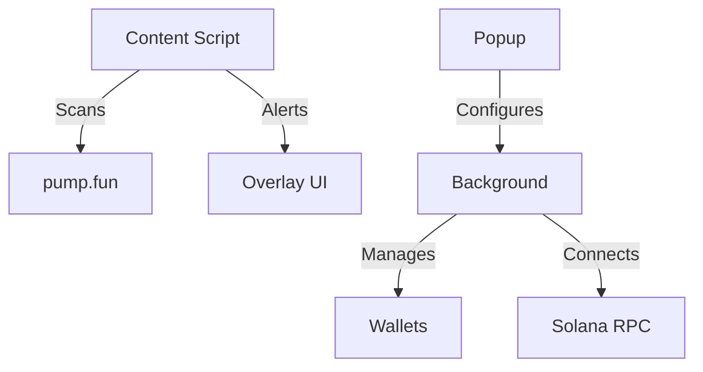

# 🐍 Ouroboros Alpha - Solana Sniper and Token Alert Bot
[](https://opensource.org/licenses/MIT)
[](https://www.typescriptlang.org/)
[](https://solana.com/)

Professional Chrome extension for Solana traders featuring:
- **Real-time token scanning** on pump.fun
- **Automated Sniper Bot with custom filters** for pump.fun
- **AI-powered rug detection** with risk scoring
- **Secure wallet integration** (AES-256 client-side encryption)
- **Custom RPC endpoint** configuration
- **0.8% protocol fee** on trades

## 🚀 Features
• Smart contract monitoring with WebSocket subscriptions
• In-page trading overlay with 1-click actions
• Multi-wallet support with password protection
• Snipe bot with customizable triggers
• Gas optimization for Solana transactions

## 📦 Installation
### Prerequisites
- Node.js v18+
- Yarn or npm
- Chrome browser

```bash
git clone https://github.com/ouroborosalphaai/ouroborosalpha.git
cd ouroboros-alpha
yarn install
yarn dev
```

Load in Chrome:
1. Go to `chrome://extensions`
2. Enable Developer mode
3. Click "Load unpacked"
4. Select the `/dist` folder

## 🛠 Building
```bash
yarn build
./scripts/deploy-extension.ps1
```

## 🏗 Architecture


## 🤝 Contributing
1. Fork the repository
2. Create your feature branch (`git checkout -b feature/your-feature`)
3. Commit changes (`git commit -m "Add amazing feature"`)
4. Push to branch (`git push origin feature/your-feature`)
5. Open a Pull Request

## 📜 License
MIT - See [LICENSE](LICENSE) for details

## 📬 Contact
• Twitter: [@OuroborosAlpha](https://twitter.com/OuroborosAlpha)
